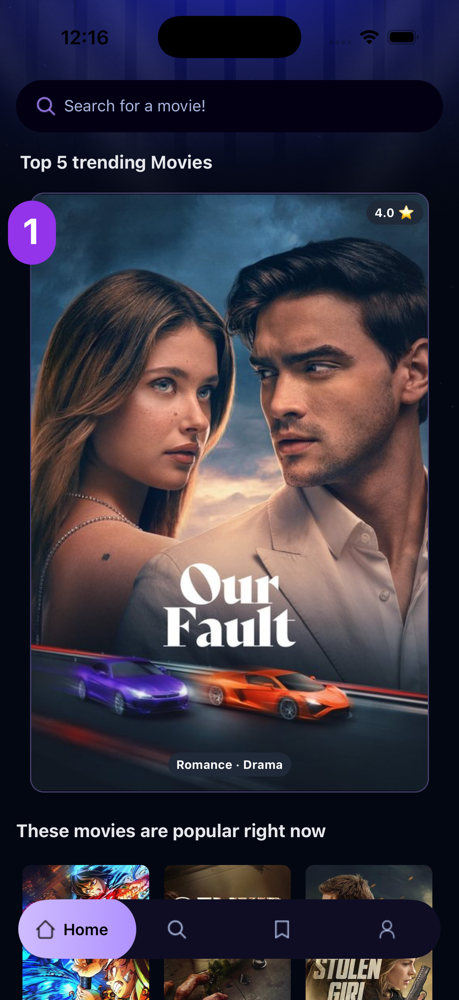
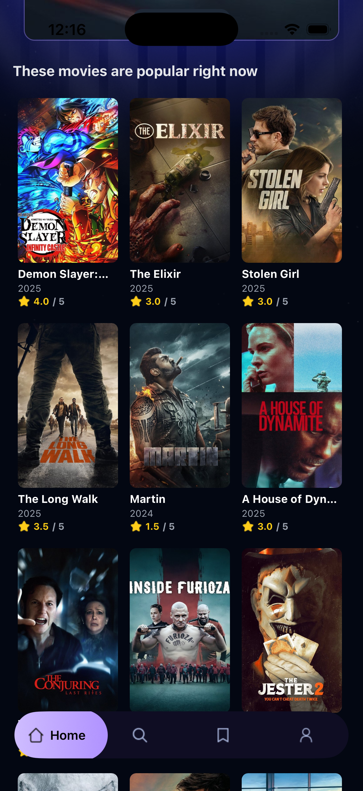
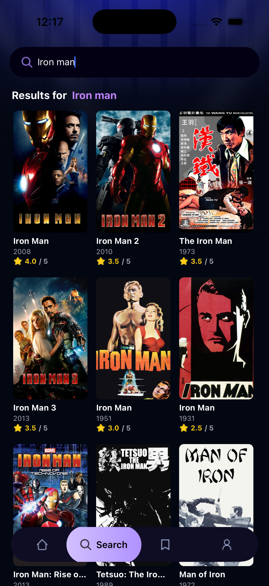

# MovieApp


A modern, feature-rich mobile application for discovering and exploring movies built with React Native and Expo.


## Table of Contents

- [Features](#features)
- [Screenshots](#screenshots)
- [Installation](#installation)
- [Usage](#usage)
- [Project Structure](#project-structure)
- [Technology Stack](#technology-stack)
- [API Integration](#api-integration)
- [Contact](#contact)

## Features

- 🎬 **Browse Trending Movies**: Discover the most popular and trending movies
- 🔍 **Advanced Search**: Search for movies by title with real-time results
- 📱 **Responsive Design**: Optimized for various screen sizes and orientations
- ⭐ **Movie Ratings**: View ratings and user scores for each movie
- 🎭 **Genre Information**: Browse movies by genre categories
- 📅 **Release Dates**: Track movie release information
- 🖼️ **High-Quality Images**: View movie posters and backdrops in high resolution
- ♿ **Accessibility**: Full accessibility support for screen readers
- 🌙 **Dark Theme**: Beautiful dark theme optimized for movie viewing
- 📲 **Cross-Platform**: Works on iOS, Android, and Web

## Screenshots

### Home Screen - Trending Movies

<div align="center">
  
</div>

<br>

### Home Screen - Popular Movies Grid

<div align="center">
  
</div>

<br>

### Search Functionality

<div align="center">
  
</div>

## Installation

### Prerequisites

Before you begin, ensure you have the following installed:

- Node.js (version 18 or higher)
- npm or yarn package manager
- Expo CLI (`npm install -g expo-cli`)
- For iOS: Xcode (on macOS)
- For Android: Android Studio with Android SDK

### Setup Steps

1. **Clone the repository**

   ```bash
   git clone https://github.com/AdriaCParra/MovieApp.git
   cd movieapp
   ```

2. **Install dependencies**

   ```bash
   npm install
   # or
   yarn install
   ```

3. **Set up environment variables**

   Create a `.env` file in the root directory and add your TMDB API key:

   ```env
   EXPO_PUBLIC_API_KEY=your_tmdb_api_key_here
   ```

   To get an API key:
   - Sign up at [The Movie Database (TMDB)](https://www.themoviedb.org/)
   - Go to your account settings and request an API key
   - Copy the API key to your `.env` file

4. **Start the development server**

   ```bash
   npm start
   # or
   expo start
   ```

5. **Run on your preferred platform**

   ```bash
   # For iOS
   npm run ios
   # or
   expo start --ios

   # For Android
   npm run android
   # or
   expo start --android

   # For Web
   npm run web
   # or
   expo start --web
   ```

## Usage

### Home Screen

The home screen displays:

- A search bar to navigate to the search functionality
- Top 5 trending movies in a horizontal carousel
- A grid of popular movies below the carousel

### Search Screen

The search screen allows you to:

- Type in the search bar to find movies by title
- View search results in a responsive grid layout
- See real-time search results with debouncing for performance

### Movie Details

Tap on any movie card to view detailed information including:

- Movie poster and backdrop images
- Title, release date, and rating
- Genre information
- Overview and synopsis

### Navigation

Use the bottom tab navigation to switch between:

- Home: Browse trending and popular movies
- Search: Search for specific movies
- Saved: View your saved movies (feature in development)
- Profile: User profile and settings (feature in development)

## Project Structure

```
movieapp/
├── app/                          # Main application directory
│   ├── (tabs)/                   # Tab navigation screens
│   │   ├── _layout.tsx           # Tab navigation layout
│   │   ├── index.tsx             # Home screen
│   │   ├── search.tsx            # Search screen
│   │   ├── saved.tsx             # Saved movies screen
│   │   └── profile.tsx           # Profile screen
│   ├── movies/                   # Movie-related screens
│   │   └── [id].tsx              # Movie details screen
│   ├── _layout.tsx               # Root layout
│   └── globals.css               # Global styles
├── assets/                       # Static assets
│   ├── fonts/                    # Custom fonts
│   ├── icons/                    # App icons
│   └── images/                   # Images and graphics
├── components/                   # Reusable components
│   ├── common/                   # Common utility components
│   │   ├── RenderEmpty.tsx       # Empty state component
│   │   ├── RenderError.tsx        # Error state component
│   │   └── RenderLoading.tsx     # Loading state component
│   ├── MovieCard.tsx             # Movie card component
│   ├── SearchBar.tsx             # Search bar component
│   └── TopMovieCard.tsx          # Featured movie card component
├── constants/                    # App constants
│   ├── icons.ts                  # Icon paths
│   └── images.ts                 # Image paths
├── hooks/                        # Custom React hooks
│   └── useFetchMovies.ts         # Movie data fetching hook
├── interfaces/                   # TypeScript interfaces
│   └── interfaces.d.ts           # Type definitions
├── services/                     # API services
│   └── api.ts                    # TMDB API integration
├── types/                        # TypeScript types
│   └── images.d.ts               # Image type definitions
├── utils/                        # Utility functions
│   └── movieUtils.ts             # Movie-related utilities
├── docs/                         # Documentation
│   └── useFetch-analysis.md      # Hook analysis documentation
├── .env                          # Environment variables
├── .gitignore                    # Git ignore file
├── app.json                      # Expo configuration
├── babel.config.js               # Babel configuration
├── components.json               # Component configuration
├── eslint.config.js              # ESLint configuration
├── metro.config.js               # Metro bundler configuration
├── package.json                  # Project dependencies
├── tailwind.config.js            # Tailwind CSS configuration
└── tsconfig.json                 # TypeScript configuration
```

## Technology Stack

| Technology                   | Version | Description                   |
| ---------------------------- | ------- | ----------------------------- |
| React Native                 | 0.81.5  | Mobile app framework          |
| Expo                         | 54.0.19 | Platform and toolchain        |
| TypeScript                   | 5.9.2   | Type-safe JavaScript          |
| Expo Router                  | 6.0.13  | File-based routing            |
| NativeWind                   | 4.1.23  | Tailwind CSS for React Native |
| React Navigation             | 7.1.6   | Navigation library            |
| React Native Reanimated      | 4.1.1   | Animations library            |
| React Native Gesture Handler | 2.28.0  | Touch gesture handling        |
| Expo Image                   | 3.0.10  | Optimized image component     |
| Tailwind CSS                 | 3.4.17  | Utility-first CSS framework   |

## API Integration

This app uses [The Movie Database (TMDB) API](https://www.themoviedb.org/documentation/api) to fetch movie data.

### API Endpoints Used

- **Discover Movies**: `/discover/movie` - Fetches popular movies sorted by popularity
- **Search Movies**: `/search/movie` - Searches for movies by title
- **Movie Details**: `/movie/{id}` - Fetches detailed information about a specific movie
- **Configuration**: `/configuration` - Fetches API configuration including image base URLs

### API Configuration

The API configuration is defined in [`services/api.ts`](services/api.ts):

```typescript
export const TMDB_CONFIG = {
  BASE_URL: "https://api.themoviedb.org/3",
  API_KEY: process.env.EXPO_PUBLIC_API_KEY,
  headers: {
    accept: "application/json",
    Authorization: `Bearer ${process.env.EXPO_PUBLIC_API_KEY}`,
  },
};
```

### Data Fetching

The app uses custom hooks in [`hooks/useFetchMovies.ts`](hooks/useFetchMovies.ts) to handle API requests:

- `useFetch`: Generic data fetching hook with loading, error, and retry functionality
- `useFetchMovies`: Specific hook for fetching movies with pagination support
- `usePaginatedFetch`: Hook for paginated data fetching
- `useInfiniteMovies`: Hook for infinite scrolling with debounced search

This project is licensed under the MIT License - see the [LICENSE](LICENSE) file for details.

```
MIT License

Copyright (c) 2024 MovieApp

Permission is hereby granted, free of charge, to any person obtaining a copy
of this software and associated documentation files (the "Software"), to deal
in the Software without restriction, including without limitation the rights
to use, copy, modify, merge, publish, distribute, sublicense, and/or sell
copies of the Software, and to permit persons to whom the Software is
furnished to do so, subject to the following conditions:

The above copyright notice and this permission notice shall be included in all
copies or substantial portions of the Software.

THE SOFTWARE IS PROVIDED "AS IS", WITHOUT WARRANTY OF ANY KIND, EXPRESS OR
IMPLIED, INCLUDING BUT NOT LIMITED TO THE WARRANTIES OF MERCHANTABILITY,
FITNESS FOR A PARTICULAR PURPOSE AND NONINFRINGEMENT. IN NO EVENT SHALL THE
AUTHORS OR COPYRIGHT HOLDERS BE LIABLE FOR ANY CLAIM, DAMAGES OR OTHER
LIABILITY, WHETHER IN AN ACTION OF CONTRACT, TORT OR OTHERWISE, ARISING FROM,
OUT OF OR IN CONNECTION WITH THE SOFTWARE OR THE USE OR OTHER DEALINGS IN THE
SOFTWARE.
```

## Contact

- **Project Maintainer**: [Adrià Costa Parra](mailto:Costaadria524@gmail.com)
- **Project Link**: [https://github.com/AdriaCParra/MovieApp.git](https://github.com/AdriaCParra/MovieApp.git)

## Acknowledgments

- [The Movie Database (TMDB)](https://www.themoviedb.org/) for providing the movie data API
- [Expo](https://expo.dev/) for the amazing development platform
- [React Native](https://reactnative.dev/) for the cross-platform mobile framework
- [Tailwind CSS](https://tailwindcss.com/) for the utility-first CSS framework
- All the contributors who have helped make this project better

---

<div align="center">
  <p>Made with ❤️ for movie enthusiasts</p>
</div>
